# SwitchProject

Hello! Geeky I am ajay UI/UX web enthusiast . I am very font of web development and I am slowly doing my best to improve 
best ever technology. This is a navbar and switch related project.This project is designed with html and css. This project mainly
focused on how the navigation bar can be accessed by radio buttons and usage of <b>css Animations</b>. This project has two 
phase . In first phase css animations and navigation bar can be expressed.The phase 2 project is a <b>Current Supplied Switch Project</b>
Which has a four switch and one main switch at the middle when each switch is turned on the current flows through the medium and 
it stops when it is turned on .Note that the current doesnot stop while the main switch is on;

## Screenshot
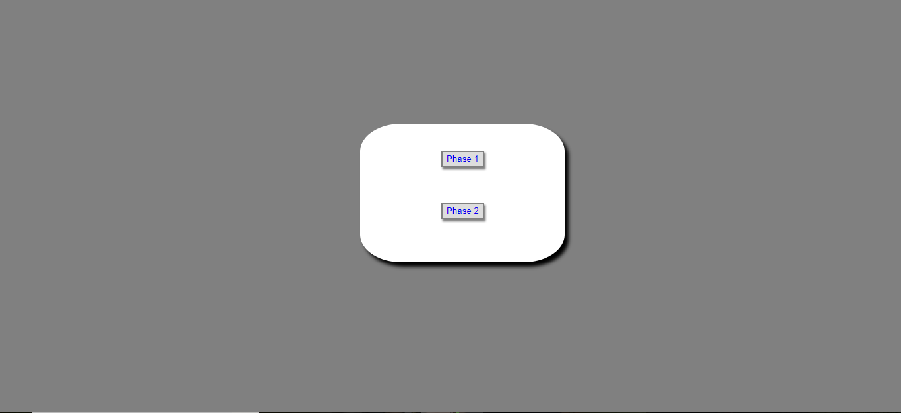
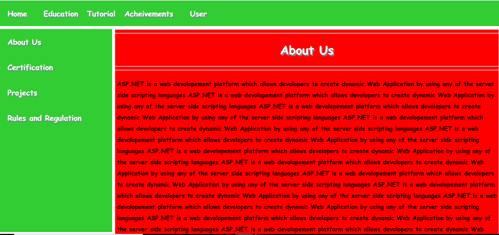
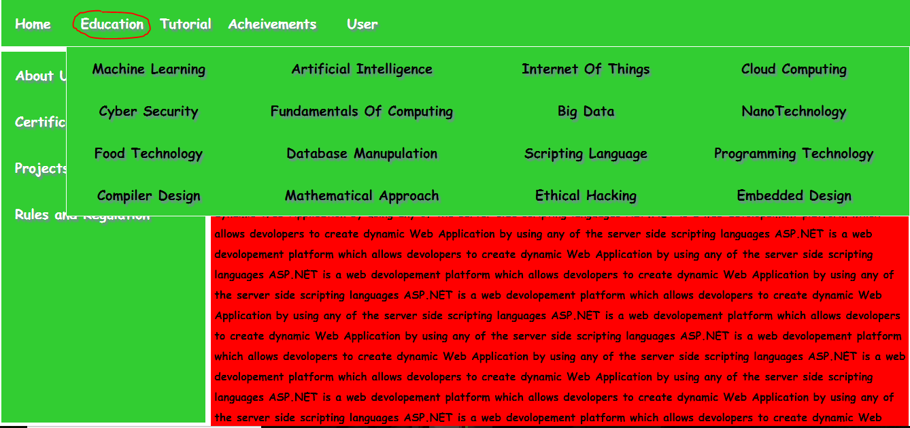
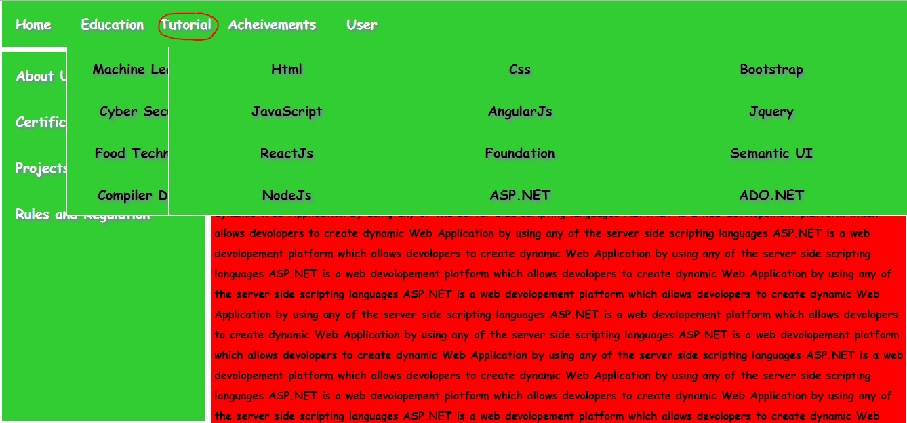
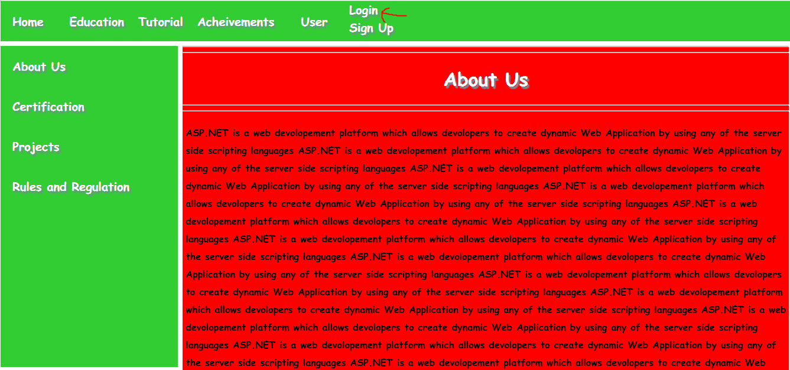
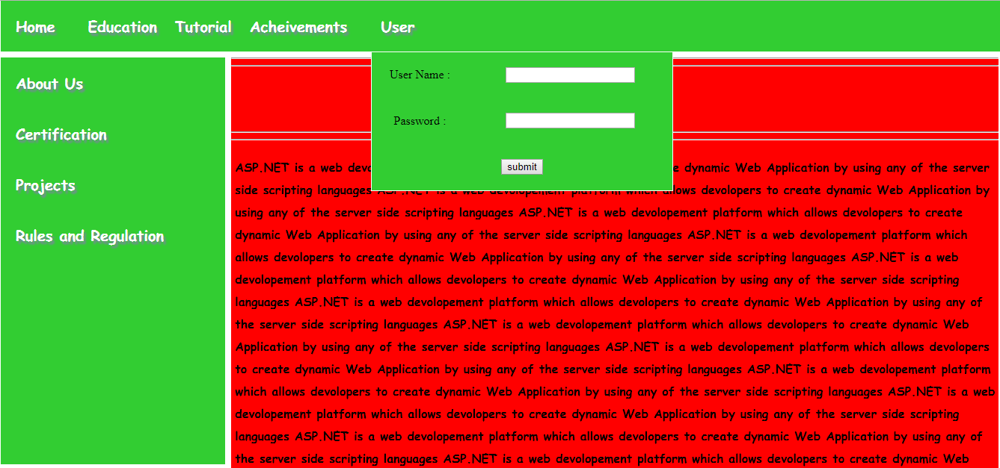
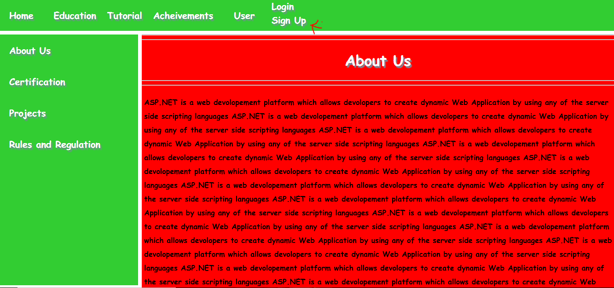
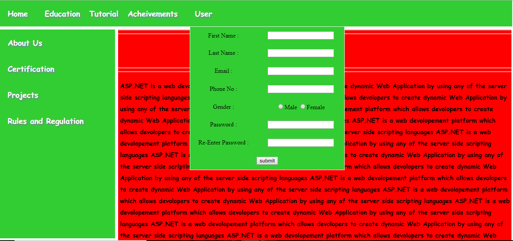
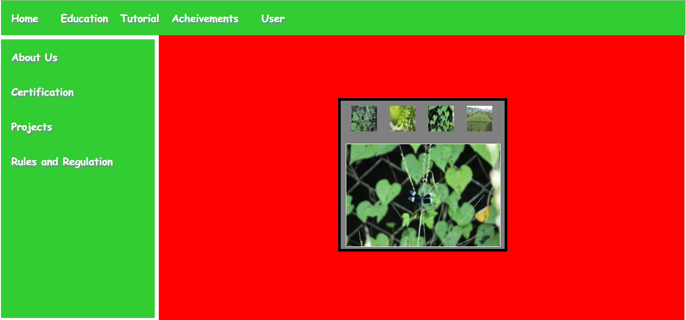
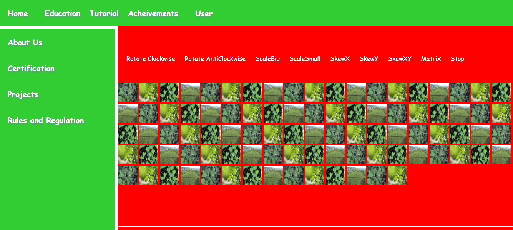

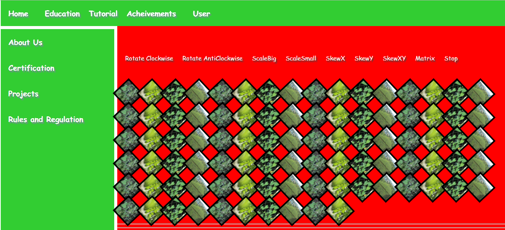
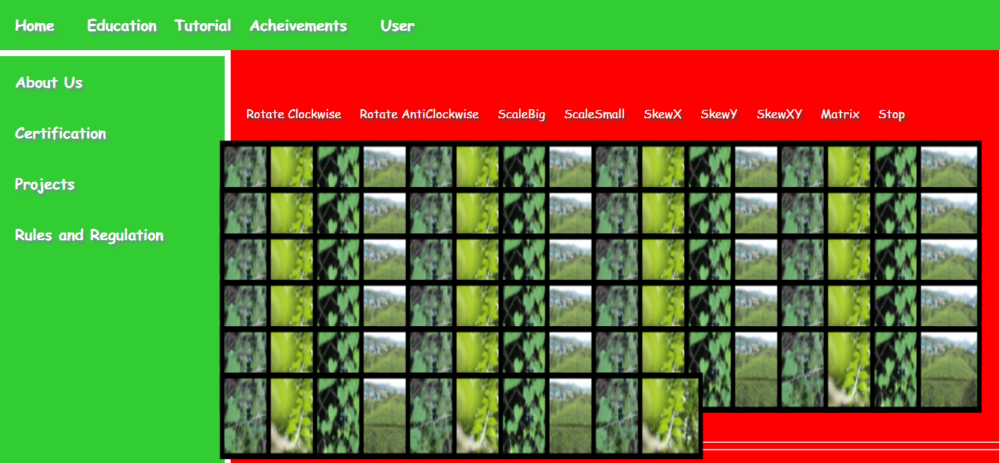
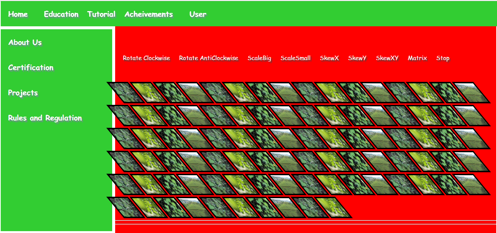
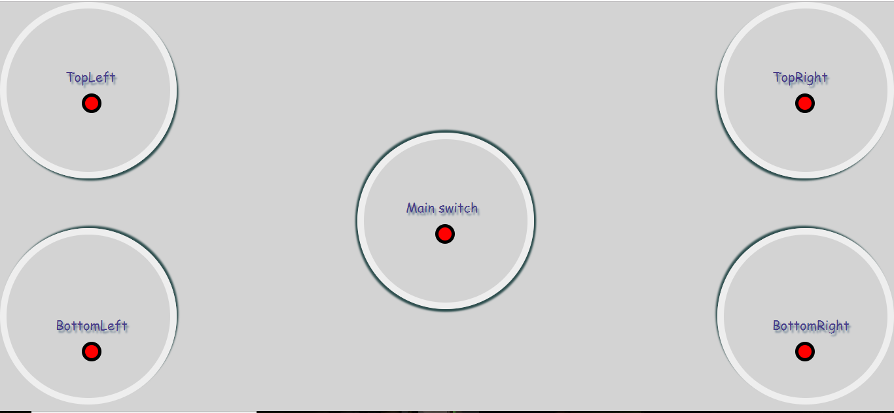

<video width="500" height="500" autoplay controls>
  <source src="video/1.mp4" type="video/mp4">
  <source src="1.ogg" type="video/ogg">
  The video has attached to the video directory
</video>

